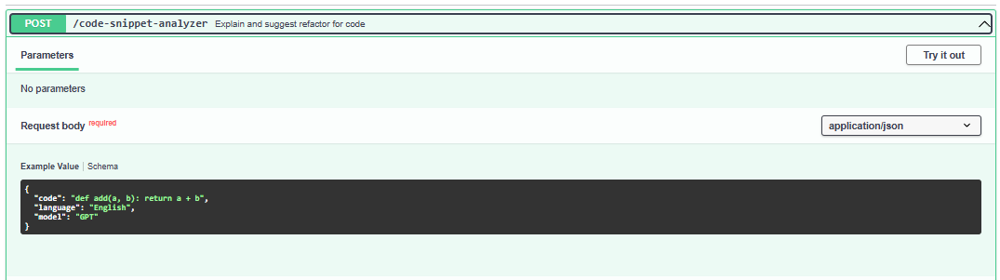
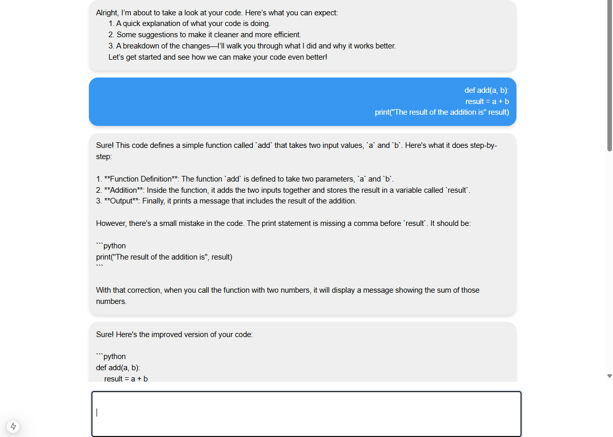

# Plank AI : Code Snippet Refactoring & Explanation Tool


**Goal:**
Create a web application where a user can input a code snippet and receive:

- A natural-language explanation of what the code does.
- A refactored version of the code.
- A step-by-step reasoning of how the explanation was derived.


## Here is the final result: 


## Improvements I Would Apply If I Had More Time

- I configured the API to handle different languages, but I didn’t have time to implement personalized settings for the user.
I would add a validation step to ensure that the text submitted by the user is actually code.

- I followed the principles of Clean Architecture to improve the separation of responsibilities and make it easier to expand the app's scope. My initial idea was also to use free Gemini models, and with the way the code was implemented, adding other models or use cases would be extremely simple.

- I considered adding mechanisms to reduce costs by limiting the max_tokens. I even tested this, but to effectively customize these more technical parameters, more time is required.

- I’m primarily a backend developer, so I felt somewhat limited when working on the frontend features, especially the components. One lesson I learned at my current company, Pelando, is that "done is better than perfect." With this in mind, I focused on delivering the basics in the best way possible within the time I had. That’s why I didn’t prioritize creating icons or other visual elements—I wanted to build a clean and lightweight application.

# Fast API - Backend Server Setup



**This guide will help you set up the project, install dependencies, and run the application.**

## 1. Set Up Virtual Environment

**First, create and activate a virtual environment to isolate the project dependencies.**

For **Windows**:

```bash

.\venv\Scripts\Activate

```

For **Mac/Linux:**:

```bash

source venv/bin/activate

```
## 2. Install Dependencies

**Once the virtual environment is activated, install the required dependencies using pip:**

```bash

pip install -r requirements.txt

```
## 3. Start the Project

**To run the project, execute the main.py file:**

```bash

python main.py

```

**Or**

```bash

uvicorn main:app --reload

```

## 3. Access the Documentation

**FastAPI automatically generates interactive API documentation (Swagger):**

- **Swagger UI:** http://localhost:8000/docs
- **ReDoc UI:** http://localhost:8000/redoc


# Next.JS - Chat App Setup



Before you begin, ensure that you have the following tools installed:

- [Node.js](https://nodejs.org/) 
- [npm](https://www.npmjs.com/) or [Yarn](https://yarnpkg.com/) (package manager)

## 1. Installation

Clone this repository to your local machine:

```bash
git clone https://github.com/username/repository.git
```
 
##  2. Navigate to the project directory:

```bash 
cd .\chat-app\
```

## 3. Install the project dependencies:

1. If you're using npm:

If you're using npm:

```bash 
npm install
```

Or, if you're using Yarn:

```bash 
yarn install
```
##  4. Running the Project

To run the project in development mode, use the following command:

If you're using npm:


```bash 
npm run dev
```

Or, if you're using Yarn:

```bash 
yarn dev
```
The project will be available at:

   - Local:        http://localhost:3000
   - Network:      http://192.168.15.3:3000


## Common Scripts


- Development: npm run dev or yarn dev – Starts the development server.

- Build: npm run build or yarn build – Creates the production version of the project.

- Start in Production: npm start or yarn start – Runs the project in production mode after building.

